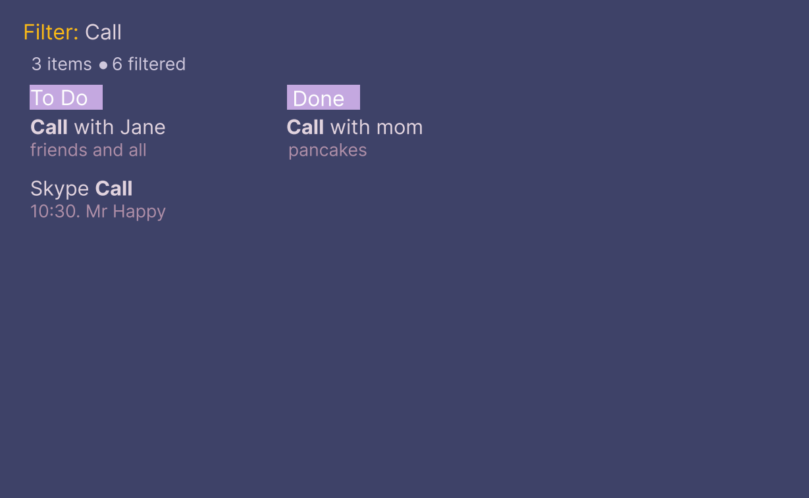

# TRiTPO_Lab2# Требования к проекту
---

# Содержание
1 [Введение](#intro)  
1.1 [Назначение](#appointment)  
1.2 [Бизнес-требования](#business_requirements)  
1.2.1 [Исходные данные](#initial_data)  
1.2.2 [Возможности бизнеса](#business_opportunities)  
1.2.3 [Границы проекта](#project_boundary)  
1.3 [Аналоги](#analogues)  
2 [Требования пользователя](#user_requirements)  
2.1 [Программные интерфейсы](#software_interfaces)  
2.2 [Интерфейс пользователя](#user_interface)  
2.2.1 [Команды и горячие клавиши](#hot_keys)                                                                                                           
2.2.2 [Работа по шагам](#example_of_work)                                                                         
2.3 [Характеристики пользователей](#user_specifications)  
2.3.1 [Классы пользователей](#user_classes)  
2.3.2 [Аудитория приложения](#application_audience)  
2.3.2.1 [Целевая аудитория](#target_audience)  
2.3.2.1 [Побочная аудитория](#collateral_audience)  
2.4 [Предположения и зависимости](#assumptions_and_dependencies)  
3 [Системные требования](#system_requirements)  
3.1 [Функциональные требования](#functional_requirements)  
3.1.1 [Основные функции](#main_functions)  
3.1.1.1 [Функции редактирования](#red_functions)  
3.1.1.2 [Режим ввода новой задачи](#add_new)  
3.1.1.3 [Режим изменения задачи](#change_task)   
3.1.2 [Ограничения и исключения](#restrictions_and_exclusions)  
3.2 [Нефункциональные требования](#non-functional_requirements)  
3.2.1 [Атрибуты качества](#quality_attributes)  
3.2.1.1 [Требования к удобству использования](#requirements_for_ease_of_use)   
3.2.2 [Внешние интерфейсы](#external_interfaces)  
3.2.3 [Ограничения](#restrictions)  

<a name="intro"/>

# 1 Введение

<a name="appointment"/>

## 1.1 Назначение
Документ разработан для однозначной трактовки требований между разработчиком и заказчиком.  Необходимо разработать desktop приложение системы напоминаний с использованием парадигмы Kanban.
В этом документе описаны функциональные и нефункциональные требования к desktop приложению «CLIboard» для Linux. Этот документ предназначен для команды, которая будет реализовывать и проверять корректность работы приложения. 

<a name="business_requirements"/>

## 1.2 Бизнес-требования

<a name="initial_data"/>

### 1.2.1 Исходные данные
С развитием и распространением парадигм менеджмента (систем управления kanban,scrum и т.д.) возникла необходимость наглядных средств коммуникации между командой и заказчиком. Людям, желающим применить эти парадигмы на практике,необходимо отслеживать выполнение задач, получать feedback, но главное, контролировать производительность сотрудников, чтобы избежать неравномерного распределения работы.   

<a name="business_opportunities"/>

### 1.2.2 Возможности бизнеса
Каждый деловой человек использует системы напоминаний. Начиная с записных книжек и заканчивая системами Agile с возможностью контроля задач целой организации. Учитывая индивидуальные потребности каждого пользователя возможно создавать востребованное программное обеспечение необходимое в течение продолжительного времени (если оно сделано хорошо, разумеется).

<a name="project_boundary"/>

### 1.2.3 Границы проекта
Приложение «CLIboard» ("Command Line Interface Board") позволит создавать Kanban доски для личного пользования с возможностью выставлять время выполнения и подробности задачи. Присутствует возможность редактирования задач и перехода по доступным доскам. Весь интерфейс реализуется средствами командой строки Linux. Предусмотреть возможность синхронизации задач и времени их выполнения с прочими приложениями тайм-менеджмента (Trello, Напоминания IOS и т.д.).

<a name="analogues"/>

## 1.3 Аналоги
Trello, Аспро.Agile, Flowlu-Bipulse - графические редакторы для тайм-менеджмента проектов команды/пользователя. Позволяют использовать несколько систем управления или совмещать их.
Аналог использования интерфейса командной строки:
ranger - файловый менеджер, аналогичный проводнику Windows.
nvim,gvim,vim,vi,nano - системы редактирования текстовых файлов с максимальным использованием горячих клавиш и минимальной визуальной нагрузкой.

<a name="user_requirements"/>

# 2 Требования пользователя

<a name="software_interfaces"/>

## 2.1 Программные интерфейсы
"CLIboard" должен отличаться минималистичным дизайном и скоростью работы. Он прежде всего рассчитан на личное пользование одного человека. Горячие клавиши должны соответствовать принятым в vim или nano.
Продукт должен являться приложением командной строки Linux (совместимость с zsh,bash,kitty и т.д). Приложение должно быть реализовано с использованием фрэймворка bubbletea и языка программирования Go.Созданные доски хранятся c помощью SQL (без использования дополнительных фрэймворков) в файловой системе пользователя.

<a name="user_interface"/>

## 2.2 Интерфейс пользователя

#### 2.2.1 Команды и горячие клавиши 

Для начала работы команды необходимо вводить клавишу Enter.
Для вхождения в режим ввода команд необходимо нажать клавишу ESC.

Список команд: 

1. :open FILE_PATH - команда открытия доски, в случае, если данной доски не существует, она будет создана. Возможно автодополнение пути фала при нажатии      клавиши Tab. 
2. :filter PARAMETR -команда сортировки по введенному параметру. 
3. :time ON/OFF - отображение времени выполнения задач из доски 
4. :second_task ON/OFF - отображение подпунктов задач
5. :show PARAMETR - временно показать PARAMETR, который может на данный момент не отображаться в задачах. Для выхода необходимо нажать клавишу esc.
6. :w - сохранение изменений 
7. :q - выход из приложения 
8. :new NAME - создание новой доски с именем NAME 
9. :select - вход в режим поиска всех существующих досок и/или создания новых. 
10. a - добавть элемент в выделенную доску

<a name="hot_keys"/>

#### 2.2.2 Работа по шагам

Пример выбора доски.  

Для входа в программу необходимо войти в консоль и ввести название CLIboard BOARD_NAME, в случае, если имя доски не было введено, пользователю будет предложено выбрать доску (см. Пример выбора доски), с которой он будет работать. Для выбора доски можно воспользоваться клавишами w a s d или arrowkeys. Название выбираемой доски будет выделяться цветом. Для окончательного выбора доски необходимо нажать клавишу enter. В случае необходимости создания новой доски, пользователю необходимо выбрать команду :new NAME.

Во время работы в любой момент можно изменить редактируемую доску. Для этого необходимо ввести команду :select<Enter>.

После выбора доски пользователю доступны все команды и горячие клавиши из пункта 2.2.1. 

Пример доски.  

В левом верхнем углу отображается название доски. В случае ввода команды после символа двоиточия начинается отображение вводимой команды. После введения команды при переходе в новый режим, название этого режима отображается перед символом двоеточия желтым цветом.
Консоль поделена на три части, с своим названием доски соответсвенно. 
Доска, с которой пользователь работает на данный момент выделяется прямоугольником. Задача, которую пользователь может отметить как выполненную и/или изменить ее содерание, выделяется другим цветом и внешним видом. 
Для того, чтобы отметить выполненую задачу, как таковую, необходимо выделить эту задачу и нажать клавишу enter. Рядом с выполненной задачей будет отображаться соответсвующий символ. 
В случае, если содержание всех задач невозможно отобразить полностью, данный факт помечается символами ^^^. 
Для добавления нового элемента необходимо нажать клавишу a или :add находясь в режиме ввода команд.   

Интерфейс добавления элемента.  

Добавляемое поле будет выделяться фиолетовым цветом (иметь соответсвующий стиль). После окончания добавления стоит нажать Enter и начать добавлять следующее поле. После ввода поля возможно изменить его содержимое, выбрав соответсвующий элемент с помощью arrowkeys и нажав enter. Если задача бессрочная, необходимо выбрать параметр "время" и нажать клавишу delete. Для выхода из режима добавления элемента необходимо нажать клавишу esс (выход без сохранения изменений) или :y для сохранения изменений и обавления нового элемента в доску. 

Интерфейс изменения элемента.  

Аналогичен интерфейсу добавления элемента. 

Интерфейс отображаемых характеристик.  

Изменения внешнего вида в зависимости от введенных параметров из списка поддерживаемых.
Список поддерживаемыйх параметров:
time - отображение времени всех задач доски 
deadline - отображение просроченных задач (появляется символ красного цвета)
complited - отображение выполненных задач
all - отображение всех задач одним списком. 

Пример сортировки по одному из параметров.  

Возможна сортировка по параметрам из списка поддерживаемых, плюс также можно сортировать задачи по алфавиту, по времени выполнения и по ключевому слову. Также возможно выбрать параметры по врмени выполнения (раньше даты, или позже даты).
10.10.2020 b - раньше даты 
10.10.2020 a - позже даты 
Call - ключевое слово (в пунктах и подпунктах, с учетом регистра)
Call p - только в пунктах
Call pp - только в подпунктах
alphabet - по алфавиту 
time e - по времени выполнения (начиная с самых ранних) 
time l - по времени выполнения (начиная с самых поздних)
time d - начиная с просроченных
complited - все выполненные задачи

Команды можно совмещать друг с другом. К примеру, выполненные задачи можно сортировать по их полям (complited time l - пример такой команды)  

<a name="example_of_work"/>

<a name="user_specifications"/>

## 2.3 Характеристики пользователей

<a name="user_classes"/>

### 2.3.1 Классы пользователей

Приложение не требует регистрации, все пользователи в равных условиях

<a name="application_audience"/>

### 2.3.2 Аудитория приложения

<a name="target_audience"/>

#### 2.3.2.1 Целевая аудитория
Пользователи любой популярной командной оболочки Linux (vim,nvim,gvim).
<a name="collateral_audience"/>

#### 2.3.2.2 Побочная аудитория
Пользователи предпочитающие тайловые оконные менеджеры и минималистичный графический интерфейс.

<a name="assumptions_and_dependencies"/>

## 2.4 Предположения и зависимости
1. При выборе синхронизации с online-сервисами (Trello, облачным хранилищем ios) необходимо подключение к сети Интернет
2. Для подгрузки соответствующих тем (шрифт, размер текста, цвет), установленных в системе необходима поддержка комнадной оболочки и знание местоположения ее config-файла

<a name="system_requirements"/>

# 3 Системные требования

<a name="functional_requirements"/>

## 3.1 Функциональные требования

<a name="main_functions"/>

### 3.1.1 Основные функции

<a name="red_functions"/>

#### 3.1.1.1 Функции редактирования
**Описание.** функции, начинающие свою работу при введении пользователем сочетания клавиш esc:"название функции"

| Функция | Требования | 
|:---|:---|
| <a name="registration_requirements"/>Add | Приложение должно войти в режим ввода новой задачи|
| Select | Приложение должно перечислить доступные доски и при выборе пользователя отобразить соответствующие ей задачи|
| Change | Приложение должно войти в режим изменения задачи|
| Filter | Приложение должно войти в режим сортировки по введенному параметру (time, date, keyphrase) - вывод из этой функции - доступные задачи на каждом элементе доски|
| Changing of viewing properties | Приложение должно изменить отображаемые характеристики (время выполнения, важность, дополнительная информация)|

<a name="add_new"/>

#### 3.1.1.2 Режим ввода новой задачи
**Описание.** После вхождения в этот режим пользователь последовательно вводит поля названия, дополнительной информации и времени выполнения задачи. 

<a name="change_task"/>

#### 3.1.1.3 Режим изменения задачи
**Описание.** После вхождения в этот режим пользователь может изменить содержимое выбранного поля при нажатии enter, для окончания редактирования поля необходимо еще раз ввести enter. 

<a name="view_task"/>

#### 3.1.1.4 Режим просмотра задач
**Описание.** В этом режиме возможно перемещать задачи в разные части доски (Done, In progress, To Do). 

<a name="restrictions_and_exclusions"/>

#### 3.1.2 Вывод функций
**Описание.** Допустима следующая последовательность действий: режим filter - режим change - то есть, выбранную задачу из отсортированных можно редактировать. Необходимо предусмотреть все возможные сочетания команд, имеющие смысл.  

## 3.2 Нефункциональные требования

<a name="quality_attributes"/>

### 3.2.1 Атрибуты качества

<a name="requirements_for_ease_of_use"/>

#### 3.2.1.1 Требования к удобству использования
1. Поддержка горячих клавиш vim 
2. Поддержка последовательности команд, работающих с выводом друг друга 
3. Наличие подсказок 

<a name="external_interfaces"/>

### 3.2.2 Внешние интерфейсы
Может работать без графической оболочки. 

<a name="restrictions"/>

### 3.2.3 Ограничения
1. Использование фрэймворков для работы с SQL
2. Использование графических библиотек 
